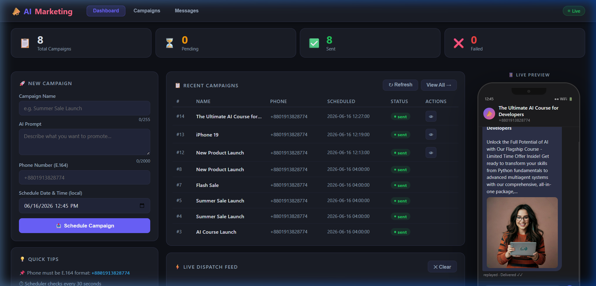
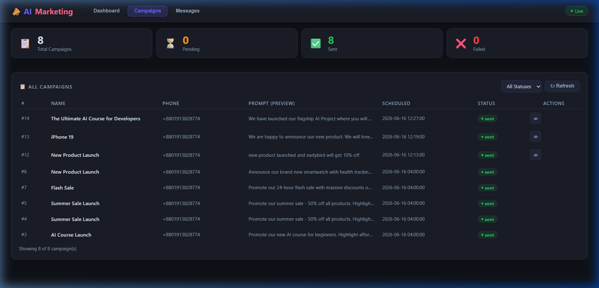
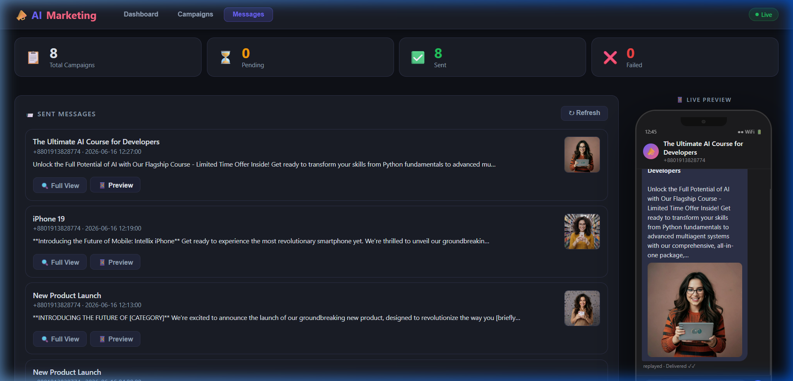

# AI Marketing Automation System

A Python backend that creates, schedules, and auto-dispatches AI-generated marketing campaigns.

## 📱 Web UI Interface Previews

| Dashboard Overview | Campaigns Table | Live Preview & Mockup |
| :---: | :---: | :---: |
|  |  |  |

- **Text generation** — Groq API (`llama-3.1-8b-instant`, free tier)
- **Image generation** — Pollinations.AI (free, no key needed)
- **Storage** — SQLite (zero setup, file-based)
- **API** — FastAPI with auto-generated Swagger docs
- **Scheduling** — background thread polls every 30 seconds

---

## Prerequisites

- Python 3.10 or higher (or Docker Desktop installed)
- A free [Groq API key](https://console.groq.com) (already included in `.env`)

---

## Setup

### 1. Clone / open the project

```bash
cd "AI Marketing Automation System"
```

### 2. Create a virtual environment

```bash
python -m venv venv

# Windows
venv\Scripts\activate

# macOS / Linux
source venv/bin/activate
```

### 3. Install dependencies

```bash
pip install -r requirements.txt
```

### 4. Configure environment variables

The `.env` file in the project root is already set up with your Groq key:

```env
GROQ_API_KEY=your_groq_api_key_here

# Optional overrides (defaults shown)
DB_PATH=campaigns.db
SCHEDULER_INTERVAL_SECONDS=30
# Timezone for Docker container logs, e.g. GMT+6:
TZ=Asia/Dhaka
```

---

## Run the Application

### Option A: Running natively with Python

```bash
uvicorn app.main:app --reload
```

### Option B: Running with Docker Compose

```bash
docker-compose up --build
```

### Option C: One-click Docker startup on Windows

Double-click `docker-start.bat` to build and run the app using Docker Compose.

The application and database volume will start up together.

The API starts at **http://localhost:8000**

- **Web UI** (dashboard): http://localhost:8000
- **Swagger UI** (interactive docs): http://localhost:8000/docs
- **ReDoc** (reference docs): http://localhost:8000/redoc

---

## API Endpoints

### Health Check
```
GET /health
```
```json
{ "status": "ok" }
```

---

### Create a Campaign
```
POST /campaigns
Content-Type: application/json
```
```json
{
  "campaign_name": "AI Course Launch",
  "prompt": "Promote our new AI course for beginners",
  "phone": "+8801913828774",
  "schedule_time": "2026-06-17 10:00:00"
}
```
**Response 201:**
```json
{
  "campaign_id": 1,
  "campaign_name": "AI Course Launch",
  "prompt": "Promote our new AI course for beginners",
  "phone": "+8801913828774",
  "schedule_time": "2026-06-17T10:00:00",
  "status": "pending"
}
```

---

### List All Campaigns
```
GET /campaigns
```
Returns all campaigns ordered by scheduled time (ascending).

---

### Get a Campaign by ID
```
GET /campaigns/{campaign_id}
```
Returns `404` if the campaign does not exist.

---

## How the Scheduler Works

1. On startup, a background thread starts polling every 30 seconds.
2. It fetches all `pending` campaigns whose `schedule_time <= now (UTC)`.
3. For each due campaign it:
   - Sets status → `processing` (prevents re-pickup)
   - Calls Groq API to generate marketing text
   - Constructs a Pollinations.AI image URL
   - Prints the dispatch output to console (SMS simulation)
   - Sets status → `sent`
4. If any step fails, status is set to `failed` and the error is logged.

---

## SMS Simulation Output

When a campaign is dispatched, you will see this in the console:

```
============================================================
Sending marketing message to +8801913828774
Campaign: AI Course Launch
Generated Text:
<AI-generated marketing copy here>
Generated Image:
https://image.pollinations.ai/prompt/Promote+our+new+AI+course+for+beginners
============================================================
```

---

## Project Structure

```
app/
├── main.py               # FastAPI entry point + lifespan
├── config.py             # .env loader + validation
├── logger.py             # Console + rotating file logger
├── models/
│   └── campaign.py       # Pydantic models (CampaignCreate, CampaignRecord)
├── db/
│   └── campaign_store.py # SQLite CRUD (CampaignStore)
├── services/
│   ├── text_generator.py  # Groq API text generation
│   ├── image_generator.py # Pollinations.AI URL builder
│   ├── sms_simulator.py   # Console SMS simulator
│   └── scheduler.py       # Background dispatch thread
└── api/
    └── routes.py          # FastAPI route handlers

docs/
├── PRD.md                 # Product Requirements Document
├── IMPLEMENTATION_PLAN.md # Implementation plan
└── README.md              # Docs index

campaigns.db               # SQLite DB (auto-created on first run)
app.log                    # Rotating log file (auto-created on first run)
.env                       # API keys and config
requirements.txt
README.md
```

---

## Testing Quickly (curl)

```bash
# 1. Health check
curl http://localhost:8000/health

# 2. Create a campaign scheduled 1 minute from now
curl -X POST http://localhost:8000/campaigns \
  -H "Content-Type: application/json" \
  -d '{
    "campaign_name": "AI Course Launch",
    "prompt": "Promote our new AI course for beginners",
    "phone": "+8801913828774",
    "schedule_time": "2026-06-16 10:00:00"
  }'

# 3. List all campaigns
curl http://localhost:8000/campaigns

# 4. Get campaign by ID
curl http://localhost:8000/campaigns/1
```

---

## Logs

All activity is logged to both the console and `app.log`:

```
2026-06-16 10:00:01 | INFO     | app.services.scheduler | Dispatching campaign id=1 ('AI Course Launch').
2026-06-16 10:00:02 | INFO     | app.services.scheduler | Campaign id=1 dispatched successfully.
```
